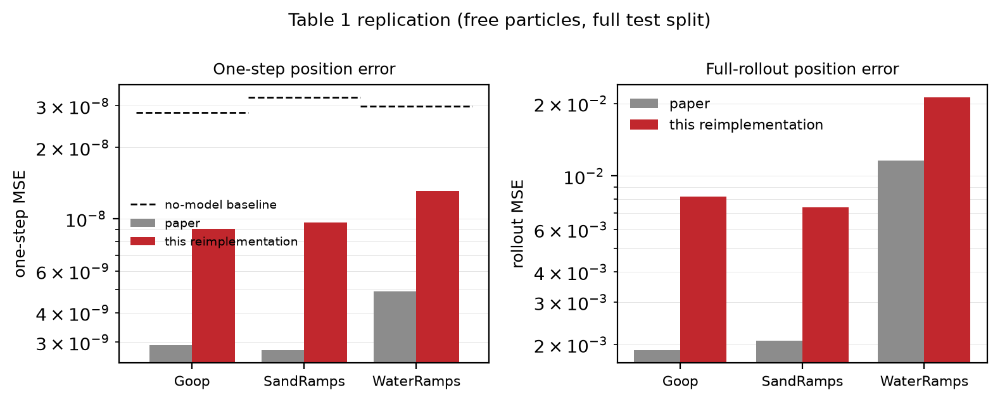
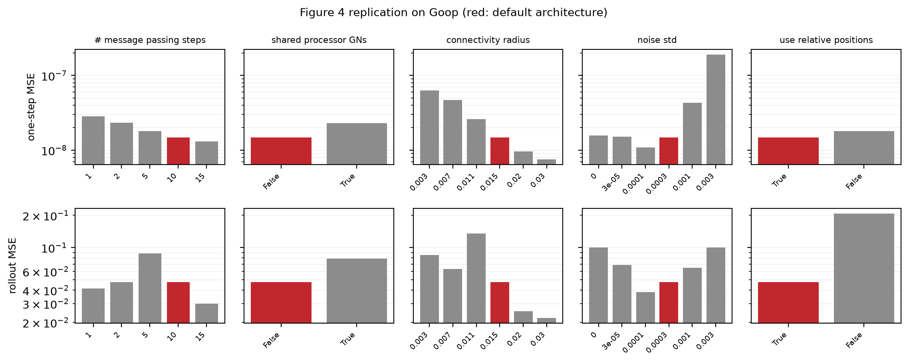
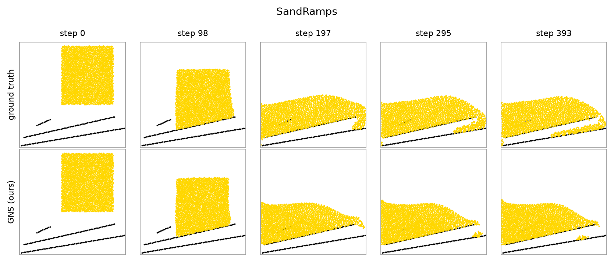
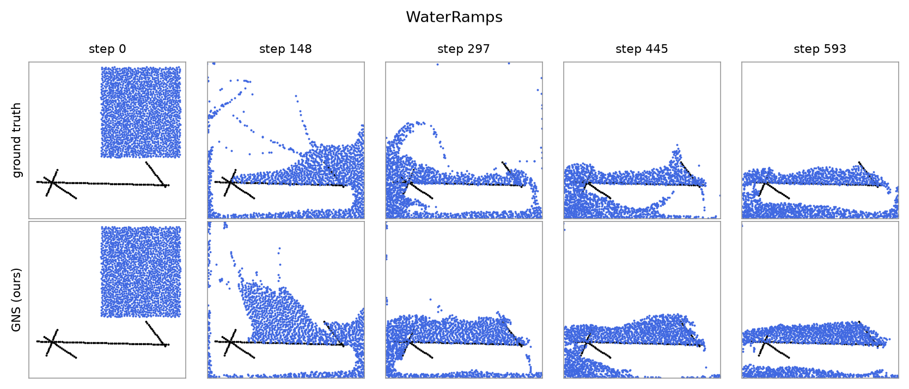
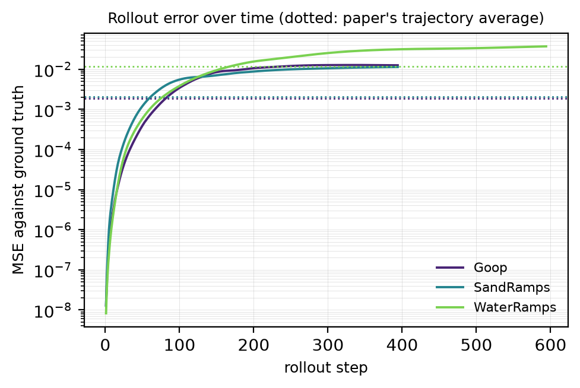

# GNS — Learning to Simulate Complex Physics with Graph Networks

A PyTorch reimplementation of Graph Network-based Simulators, built to reproduce
the numbers in

> Alvaro Sanchez-Gonzalez, Jonathan Godwin, Tobias Pfaff, Rex Ying,
> Jure Leskovec, Peter W. Battaglia.
> *Learning to Simulate Complex Physics with Graph Networks.* ICML 2020.
> [arXiv:2002.09405](https://arxiv.org/abs/2002.09405)

The authors released a TensorFlow 1 / Sonnet / graph_nets implementation under
[`deepmind-research/learning_to_simulate`](https://github.com/google-deepmind/deepmind-research/tree/master/learning_to_simulate).
Every modelling decision here follows that code; where the paper and the code
disagree, `docs/REPLICATION.md` says which one this repository implements and
why.

This is a baseline for later work, so the priority is that the numbers are
defensible and the code is reusable, not that it is clever.

## Results

Four figures are reproduced from our own runs. Full numbers, and the step count
behind each, are in [`docs/RESULTS.md`](docs/RESULTS.md).

### Table 1: one-step and rollout error



| dataset | one-step MSE | paper | rollout MSE | paper | steps |
| --- | --- | --- | --- | --- | --- |
| Goop | 9.07e-09 | 2.91e-09 | 8.23e-03 | 1.89e-03 | 1.9M |
| SandRamps | 9.62e-09 | 2.77e-09 | 7.42e-03 | 2.07e-03 | 1.3M |
| WaterRamps | 1.31e-08 | 4.91e-09 | 2.11e-02 | 1.16e-02 | 1.0M |

Within 1.8x to 4.4x of the published values, at a fraction of the paper's 20M
gradient steps. The dashed line in the figure is a no-model baseline that
predicts zero acceleration, which scores exactly the mean squared acceleration;
these models sit two to three times below it, the paper's roughly eight times.

### Figure 4: ablations on Goop



All five of the paper's conclusions reproduce. More message-passing steps is
better; unshared processor parameters beat shared ones, and by more on rollout
than on one-step; a larger connectivity radius is better; the relative encoder
is far better than an absolute one. The noise panel reproduces both effects the
paper describes: one-step accuracy falls monotonically as noise grows, while
rollout accuracy is best at an intermediate scale.

Every bar is one seed at a fixed 400k steps. The paper plots medians and
quartiles over seeds, so differences smaller than the run-to-run spread should
not be read as real.

### Figure 3: rollouts against ground truth




### Figure C.3: where the rollout error accumulates



## Install

```bash
uv sync --extra cu128          # or --extra cpu on a machine without a GPU
uv run --extra cu128 pytest tests/
```

The two accelerator extras are mutually exclusive and resolve from explicit
PyTorch indexes; switching between them re-syncs the environment.

## Data

The released datasets are TFRecord files on a public bucket. Download and
convert them once:

```bash
bash scripts/download_datasets.sh WaterRamps SandRamps Goop
uv run python -m gns.cli.convert \
    --raw  $GNS_RAW_ROOT/Goop \
    --out  $GNS_DATA_ROOT/Goop
```

Conversion writes the HDF5 layout this repository and NeuralMPM share,
`<dataset>/{train,valid,test}/sim_<i>.h5`, holding `boundary`, `particles` and
`types`; it copies the released `metadata.json` unchanged and measures
`shapes.json`. Point `GNS_DATA_ROOT` at the parent of the converted datasets.

## Train and evaluate

```bash
# The paper's default architecture; --num-steps also sets the decay horizon.
uv run python -m gns.cli.train --dataset Goop --run-dir runs/goop --num-steps 3000000

# One-step and rollout MSE on the full test split.
uv run python -m gns.cli.evaluate --checkpoint runs/goop/best.pt --split test

# Ground truth beside prediction, and a video.
uv run python -m gns.cli.render --checkpoint runs/goop/best.pt --trajectory 0 --video

# Every figure from every evaluated run.
uv run python -m gns.cli.figures all --results runs --out docs/figures
```

Checkpoints are selected on validation rollout MSE over five held-out
trajectories, as in Section 4.3. The test split is only read by `gns-evaluate`.

The batch is the paper's nominal two windows. `experiments/table1.sh` and
`experiments/ablations.sh` are the exact recipes behind the figures above.

`AGENTS.md` documents the architecture and the traps worth knowing before
changing anything; `docs/REPLICATION.md` records every choice made where the
paper and the released code disagree.

## Layout

```
src/gns/
  datasets.py       dataset registry
  metadata.py       bounds, connectivity radius, normalization statistics
  neighbors.py      radius connectivity, k-d tree and pairwise backends
  noise.py          random-walk noise on the input velocities
  paper.py          the published numbers every figure is compared against
  data/             TFRecord reader, HDF5 trajectories, one-step windows
  models/           the graph network and the learned simulator
  training/         the training loop
  evaluation/       rollouts and the two published metrics
  render/           rollout figures and videos
  cli/              convert, train, evaluate, render, figures
```
